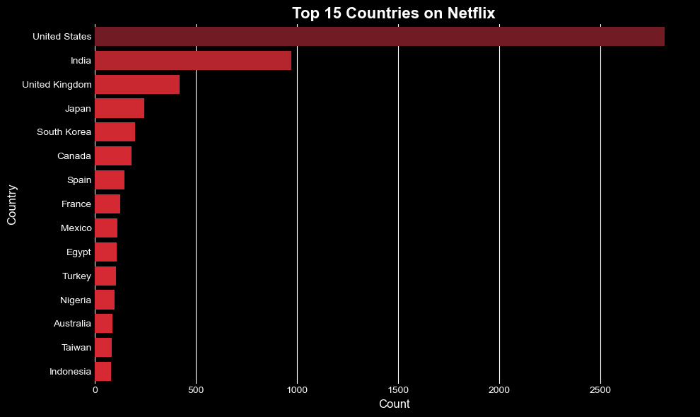
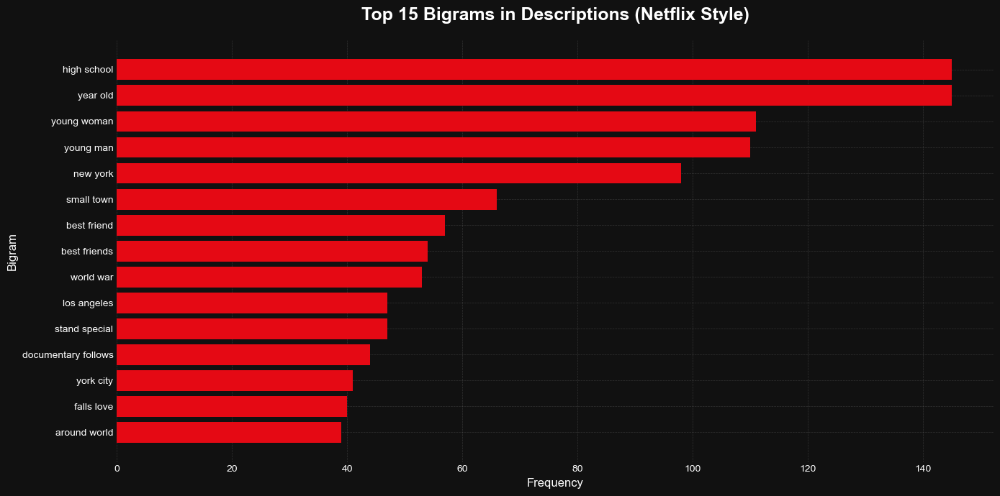

<p align="center">
  
</p>

<h1 align="center">
  
  Movies & TV Shows — EDA & NLP Analysis
</h1>

<p align="center">
  
  
  
  
  
</p>

---

# 📌 Project Overview | نظرة عامة على المشروع

  
This project provides a **comprehensive EDA + NLP analysis** of the Netflix Movies & TV Shows dataset.  
التحليل بيغطي:

 توزيع المحتوى حسب الدول والسنين  
 مقارنة Movies vs TV Shows  
 تحليل الأنواع (Genres)  
 تنظيف النصوص  
 استخراج الكلمات الأكثر تكرارًا  
 استخراج الـBigrams  
 Netflix‑Style Visualizations  

---

# 📂 Dataset | بيانات المشروع

Dataset: *Netflix Movies and TV Shows*  
Records: ~8800  
Columns: 12  

Contains:

 Title  
 Type  
 Director  
 Cast  
 Country  
 Release Year  
 Rating  
 Duration  
 Genres  
 Description  

---

# 🧹 Data Cleaning | تنظيف البيانات

Included:

 Handling missing values  
 Standardizing years  
 Splitting multi-value fields (Genres)  
 Cleaning text (lowercase, regex, stopwords)  
 Creating `clean_desc` column  

---

# 📊 Exploratory Data Analysis (EDA)

 Top 15 Countries Producing Content  
 Movies vs TV Shows Distribution  
 Content Trends Over Time  
 Average Seasons per Genre  

---

# 🧠 NLP & Text Mining | تحليل النصوص

 Text Cleaning Pipeline  
 Top Words  
 WordCloud (Netflix Style)  
 Top Bigrams  
 Genre-Level Word & Bigram Analysis  

---

# 📸 Key Visuals | أهم الصور

<p align="center">
  
  <br><em>Top 15 Countries Producing Netflix Content</em>
</p>

<p align="center">
  
  <br><em>Netflix‑Style WordCloud</em>
</p>

<p align="center">
  
  <br><em>Top 15 Bigrams in Descriptions</em>
</p>

---

# 🔍 Key Insights | أهم النتائج

 الولايات المتحدة والهند هما أكبر منتجين للمحتوى  
 الإنتاج زاد بشكل كبير بعد 2015  
 أغلب المسلسلات من موسم واحد  
 الكلمات الأكثر تكرارًا بتدور حول: young, woman, man, school, family  
 Drama وComedy هما أكثر Genres انتشارًا  

---

# 🛠 Tech Stack | الأدوات المستخدمة

 Python  
 Pandas  
 NumPy  
 Matplotlib  
 Seaborn  
 WordCloud  
 Scikit‑learn  
 Regex & NLP  

---

# 📁 Project Structure | هيكل المشروع

```text
netflix-eda-nlp-analysis/
│
├── data/
│   └── netflix_titles.csv
│
├── notebooks/
│   └── netflix_eda.ipynb
│
├── scripts/
│   ├── text_cleaning_and_bigrams.py
│   ├── genre_analysis.py
│   ├── plotting_utils.py
│   └── config.py
│
├── images/
│   ├── top_15_countries.png
│   ├── wordcloud_netflix.png
│   └── top_15_bigrams_netflix.png

# 📬 Connect With Me

<p align="center">

  <a href="https://www.linkedin.com/in/amir-ayman-664513103/" target="_blank">
    
  </a>

  <a href="https://github.com/amirayman20" target="_blank">
    
  </a>
│
└── README.md
